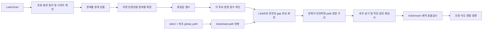

# Reactive Gap Follow

LiDAR로 주행 가능한 공간을 찾고 Ackermann 조향·속도 명령을 생성하는 ROS 2 패키지입니다. `/odom` localization과 최초 `/global_path`를 받아, 좌우 gap이 모두 안전할 때 path 방향의 gap을 우선합니다. path가 아직 없거나 localization이 오래되면 기존 LiDAR-only gap follower로 자동 복귀합니다.

이 구현은 기본 Follow-the-Gap에 다음 기능을 추가합니다.

- 차량 반경과 벽 여유를 반영한 장애물 확장
- 깊이와 주변 개방도를 함께 사용하는 목표 방향 점수
- 좌우 방향이 애매할 때 한쪽으로 너무 일찍 진입하지 않도록 하는 분기 판단
- 현재 조향각을 반영한 Ackermann 궤적 충돌검사
- LiDAR 안전조건을 통과한 후보에만 적용되는 reference path 조향 preference
- 장애물이 가까워도 완전히 정지하지 않고 저속으로 계속 움직이는 속도 제어
- RViz용 목표점, 예상 궤적, 차량 footprint 디버그 마커

## 동작 구조



### 1. LiDAR 전처리

`/scan`의 `NaN`, `Inf`, 측정 범위 밖 값은 센서의 `range_min` 또는 `range_max`로 정리합니다. 이후 전방 `-max_scan_angle`부터 `+max_scan_angle`까지만 사용합니다.

인접 포인트의 거리 차이가 `obstacle_edge_threshold`보다 크면 장애물 경계로 판단합니다. 각 경계는 다음 두 크기로 각각 확장됩니다.

- 기본 scan: `vehicle_radius`
- 선호 scan: `vehicle_radius + gap_safety_margin`

먼저 선호 scan으로 목표를 찾고, 충분한 공간이 없으면 기본 scan으로 다시 찾습니다. 따라서 평소에는 벽과 여유를 두지만 좁은 통로가 실제로 통과 가능하면 멈추지 않고 진입할 수 있습니다.

### 2. 목표 방향 점수

각 LiDAR 후보 방향 주변 `±path_check_angle`에서 두 값을 계산합니다.

- `safe_distance`: 주변 거리값을 정렬한 뒤 `safety_level` 위치에서 선택한 거리
- `width_score`: 주변 거리값을 `gap_score_distance_cap`으로 제한한 뒤 계산한 평균

최종 점수는 다음과 같습니다.

```text
score = (1 - gap_width_preference) * capped_safe_distance
        + gap_width_preference * width_score
```

`width_score`는 gap의 실제 폭을 미터로 측정한 값이 아니라, 후보 방향 주변이 얼마나 넓게 열려 있는지를 나타내는 평균 거리입니다.

`safety_level`의 의미는 다음과 같습니다.

| 값 | 선택되는 주변 거리 |
|---:|---|
| `0.0` | 최소 거리, 가장 보수적 |
| `0.2` | 아래쪽 20% 위치의 거리 |
| `0.5` | 중앙값 |
| `1.0` | 최대 거리, 가장 공격적 |

`safety_level`은 반드시 `0.0`부터 `1.0` 사이로 설정해야 합니다.

### 3. 좌우 분기 판단

선택된 목표가 `path_check_angle`보다 바깥에 있으면 반대편에서 가장 좋은 gap도 함께 계산합니다. 다음 조건을 모두 만족하면 아직 방향이 애매한 것으로 판단합니다.

- 선택 방향과 반대 방향 모두 `gap_fallback_distance`보다 깊음
- 선택 점수가 반대 점수보다 `ambiguous_gap_score_margin` 이상 확실하게 높지 않음

반대편에 더 바깥쪽으로 열린 후보가 있으면 `ambiguous_gap_opposite_weight`를 적용하여 조향에 반영합니다. 그렇지 않으면 현재 선택 방향을 유지하되 조향 크기를 `path_check_angle` 안으로 제한하여 반대편 공간이 더 보일 때까지 강조향을 늦춥니다.

이 로직은 넓고 깊어 보이지만 막혀 있는 옆 공간으로 차량이 너무 일찍 들어가, 실제 트랙 방향을 시야에서 잃는 현상을 줄이기 위한 보조 로직입니다.

### 4. Reference path 조향 preference

`/odom`의 현재 위치·yaw와 최초로 수신한 `/global_path`로부터 `path_lookahead_distance` 앞의 목표점을 구합니다. 이 목표 방향은 속도 계산에는 사용하지 않으며 gap 후보의 조향 preference에만 사용합니다.

path 가산점은 다음 LiDAR 안전조건을 모두 만족한 후보에만 적용됩니다.

- 후보 안전거리가 `path_candidate_min_clearance` 이상
- LiDAR-only 최적 gap 안전거리의 `path_candidate_min_clearance_ratio` 이상
- LiDAR-only 최적 gap 점수의 `path_candidate_min_score_ratio` 이상

따라서 path 앞이 막히고 반대쪽만 안전하면 기존 gap follower처럼 반대쪽으로 회피합니다. 좌우가 모두 위 조건을 만족할 때만 path와 가까운 방향이 선택됩니다. 경로에서 `path_rejoin_distance`보다 멀어지면 `path_rejoin_weight`가 적용되어 안전 후보 사이에서 복귀 방향 preference가 강해집니다.

유효한 `/global_path`는 pose가 두 개 이상이고 `header.frame_id`가 있어야 합니다. 노드는 최초 유효 메시지를 내부에 복사한 뒤 잠그므로 이후 path 메시지는 모두 무시합니다. 기본 QoS는 한 번 발행된 latched path를 받을 수 있도록 `reliable + transient_local`입니다. `/global_path.header.frame_id`와 `/odom.header.frame_id`가 다르면 TF로 임의 변환하지 않고 path preference를 비활성화합니다.

### 5. 조향 궤적 충돌검사

현재 조향 명령을 Ackermann 원호로 변환하고, 원호 위를 `trajectory_check_step` 간격으로 `trajectory_check_distance`까지 검사합니다. 차량 중심과 LiDAR 포인트의 거리가 다음 반경보다 작아지면 충돌로 판단합니다.

```text
collision_radius = vehicle_radius + trajectory_safety_margin
```

선택한 강조향 경로가 가까운 거리에서 막히고 반대쪽 경로가 더 길게 안전하면 반대 방향으로 전환합니다. 단순히 정면 LiDAR 거리만 보는 것이 아니라 실제 명령 조향각에 따른 이동 궤적을 검사합니다.

### 6. 속도 제어

기본 목표 속도는 안전거리에 `speed_factor`를 곱해 계산하며, 먼 공간에서는 `speed_increase_factor`만큼 점진적으로 증가합니다. 조향이 클 때는 마찰계수와 wheelbase로 계산한 선회 속도 한계를 적용합니다.

`emergency_stop_distance` 안에서 충돌이 예상되더라도 속도를 0으로 만들지 않습니다. `max_deceleration`으로 감속하면서 최소 `minimum_crawl_speed`를 유지합니다. 파라미터 이름에는 `stop`이 포함되어 있지만 현재 동작은 완전 정지가 아니라 저속 주행입니다.

## ROS 인터페이스

launch 실행 시 노드 전체 이름은 `/gap_follow/gap_follow`입니다.

| 구분 | 기본 토픽 | 메시지 | 설명 |
|---|---|---|---|
| Subscribe | `/scan` | `sensor_msgs/msg/LaserScan` | 전방 장애물 및 gap 계산 입력 |
| Subscribe | `/odom` | `nav_msgs/msg/Odometry` | path preference용 localization 입력 |
| Subscribe | `/global_path` | `nav_msgs/msg/Path` | 최초 메시지만 고정 사용하는 reference path |
| Publish | `/drive_gf` | `ackermann_msgs/msg/AckermannDriveStamped` | 조향각, 속도, 가속도 명령 |
| Publish | `/gap_follow/target_waypoint` | `geometry_msgs/msg/PointStamped` | 선택한 로컬 목표점, `debug: true`일 때 발행 |
| Publish | `/gap_follow/debug_markers` | `visualization_msgs/msg/MarkerArray` | 목표 방향, 예상 궤적, footprint, 상태 표시 |

`target_waypoint`는 지도상의 global waypoint가 아니라 현재 LiDAR frame 기준의 최종 gap 목표점입니다.

## 빌드 및 실행

ROS 2 Humble 환경을 기준으로 합니다.

```bash
source /opt/ros/humble/setup.bash
cd /home/rcv/Desktop/gap_follow
rosdep install --from-paths . --ignore-src -r -y
colcon build --packages-select gap_follow --symlink-install
source install/setup.bash
ros2 launch gap_follow gap_follow.launch.py
```

설정 파일은 [`config/gap_follow.yaml`](config/gap_follow.yaml)입니다. launch 파일이 `/gap_follow/gap_follow` 노드에 이 설정을 자동으로 적용합니다.

path 기능만 잠시 끄려면 `enable_path_guidance: false`로 설정하면 됩니다.

## rosbag 및 RViz 확인

터미널 1에서 노드를 실행합니다.

```bash
source /opt/ros/humble/setup.bash
cd /home/rcv/Desktop/gap_follow
source install/setup.bash
ros2 launch gap_follow gap_follow.launch.py
```

터미널 2에서 bag을 재생합니다.

```bash
source /opt/ros/humble/setup.bash
ros2 bag info <bag_path>
ros2 bag play <bag_path>
```

터미널 3에서 RViz를 실행합니다.

```bash
source /opt/ros/humble/setup.bash
rviz2
```

RViz에는 다음 display를 추가합니다.

| Display | Topic | 용도 |
|---|---|---|
| `LaserScan` | `/scan` | 원본 LiDAR 확인 |
| `MarkerArray` | `/gap_follow/debug_markers` | 목표 방향과 충돌검사 궤적 확인 |
| `PointStamped` | `/gap_follow/target_waypoint` | 선택 목표점 확인 |

`Fixed Frame`은 bag의 `/scan` 메시지에 기록된 frame을 사용합니다. 일반적으로 `base_link` 또는 LiDAR frame입니다. 마커가 보이지 않으면 `debug: true`, 토픽 이름, Fixed Frame과 TF 연결을 확인합니다.

## 파라미터

### 주행 방향 핵심 튜닝

| 파라미터 | 현재값 | 의미 및 조정 방향 |
|---|---:|---|
| `gap_width_preference` | `0.4` | 작을수록 깊이 우선, 클수록 주변이 넓은 방향 우선 |
| `gap_score_distance_cap` | `5.0` m | 이 거리보다 먼 값에는 추가 점수를 주지 않음 |
| `ambiguous_gap_score_margin` | `1.8` | 클수록 좌우 결정을 늦추고 반대 gap을 더 오래 비교 |
| `ambiguous_gap_opposite_weight` | `2.0` | 클수록 늦게 보이는 반대편 바깥 gap을 강하게 반영 |

### Reference path 조향 preference

| 파라미터 | 현재값 | 설명 |
|---|---:|---|
| `enable_path_guidance` | `true` | global path와 localization이 유효할 때 path 조향 preference 활성화 |
| `localization_topic` | `/odom` | `Odometry` localization 토픽 |
| `localization_timeout` | `0.5` s | 이 시간보다 오래된 pose는 사용하지 않음 |
| `global_path_topic` | `/global_path` | `nav_msgs/msg/Path` 입력 토픽 |
| `global_path_transient_local` | `true` | latched path 수신용 transient-local QoS |
| `path_is_closed` | `true` | 폐곡선 트랙 여부 |
| `path_lookahead_distance` | `1.2` m | path 진행방향의 조향 목표 거리 |
| `path_guidance_weight` | `1.0` | 평상시 안전 gap 사이의 path preference |
| `path_rejoin_weight` | `2.5` | path 이탈 시 안전 gap 사이의 복귀 preference |
| `path_rejoin_distance` | `0.5` m | 복귀 preference 적용 시작 거리 |
| `path_candidate_min_clearance` | `1.0` m | path 가산점을 허용할 절대 최소 안전거리 |
| `path_candidate_min_score_ratio` | `0.85` | LiDAR-only 최적 gap 대비 최소 기본점수 비율 |
| `path_candidate_min_clearance_ratio` | `0.8` | LiDAR-only 최적 gap 대비 최소 안전거리 비율 |
| `path_alignment_sigma` | `25.0` deg | path 방향 preference의 각도 폭 |
| `path_max_guidance_angle` | `85.0` deg | 이보다 뒤쪽인 path 목표는 무시 |
| `path_heading_search_weight` | `0.5` | 교차 경로에서 진행방향이 같은 segment 선호도 |

### 조향 및 속도

| 파라미터 | 현재값 | 설명 |
|---|---:|---|
| `max_steering_angle` | `45.0` deg | 명령 및 충돌검사에 사용하는 최대 조향각 |
| `steering_smooth_window` | `3` | 최근 조향 명령 평균 개수 |
| `speed_factor` | `0.2` | 안전거리에서 기본 속도로 변환하는 계수 |
| `max_speed` | `1.8` m/s | 최대 속도 |
| `narrow_gap_max_speed` | `0.5` m/s | 기본 차량 반경만으로 재탐색한 좁은 gap의 속도 제한 |
| `minimum_crawl_speed` | `0.20` m/s | 가까운 장애물에서도 유지하는 최저 속도 |
| `speed_increase_start` | `3.0` m | 추가 속도 배율이 시작되는 안전거리 |
| `speed_increase_end` | `15.0` m | 추가 속도 배율이 최대가 되는 안전거리 |
| `speed_increase_factor` | `1.5` | 먼 공간에서 적용할 최대 속도 배율 |
| `min_acceleration` | `0.5` m/s² | 가까운 구간의 가속도 제한 |
| `max_acceleration` | `4.0` m/s² | 열린 구간의 최대 가속도 제한 |
| `max_deceleration` | `6.0` m/s² | 최대 감속도 |

### 차량 형상 및 gap 안전 기준

| 파라미터 | 현재값 | 설명 |
|---|---:|---|
| `friction` | `0.75` | 선회 속도 계산에 사용하는 마찰계수 |
| `wheel_base` | `0.324` m | Ackermann wheelbase |
| `vehicle_radius` | `0.18` m | 장애물 확장과 충돌검사에 사용하는 차량 반경 |
| `lidar_offset_x` | `0.27` m | `base_link` 기준 LiDAR x 위치 |
| `lidar_offset_y` | `0.0` m | `base_link` 기준 LiDAR y 위치 |
| `gap_safety_margin` | `0.1` m | 선호 gap을 만들 때 차량 반경에 추가하는 벽 여유 |
| `gap_fallback_distance` | `0.5` m | 선호 gap이 부족할 때 기본 반경 scan으로 재탐색하는 기준 |
| `path_check_angle` | `30.0` deg | 후보 주변 안전거리 검사 반각이자 애매한 분기의 조향 제한 |
| `safety_level` | `0.5` | 주변 거리 분포에서 사용할 위치. 0은 최소, 1은 최대 |

### LiDAR 및 충돌검사

| 파라미터 | 현재값 | 설명 |
|---|---:|---|
| `obstacle_edge_threshold` | `0.15` m | 장애물 경계로 판단할 인접 ray 거리 차이 |
| `scan_filter_window` | `5` | 중앙값 필터 창 크기 |
| `max_scan_angle` | `90.0` deg | 전방 기준 한쪽 시야각. 실제 사용 범위는 ±90도 |
| `emergency_stop_distance` | `0.4` m | 예상 충돌이 이 거리 이내면 crawl 속도까지 감속 |
| `trajectory_check_distance` | `1.0` m | 현재 조향 궤적을 검사할 거리 |
| `trajectory_check_step` | `0.05` m | 궤적 샘플 간격 |
| `trajectory_safety_margin` | `0.05` m | 궤적 충돌검사 반경에 추가하는 여유 |
| `initial_update_time` | `0.05` s | 첫 제어 주기의 가감속 계산 시간 |

### ROS 및 디버그

| 파라미터 | 현재값 | 설명 |
|---|---:|---|
| `default_qos` | `1` | publisher와 subscriber의 QoS depth |
| `debug` | `true` | 목표점과 디버그 마커 발행 여부 |
| `lidar_scan_topic` | `/scan` | LiDAR 입력 토픽 |
| `drive_topic` | `/drive_gf` | Ackermann 명령 출력 토픽 |
| `target_waypoint_topic` | `/gap_follow/target_waypoint` | 로컬 목표점 토픽 |
| `debug_marker_topic` | `/gap_follow/debug_markers` | RViz 마커 토픽 |
| `command_frame_id` | `base_link` | drive 명령 header의 frame ID |

## 튜닝 가이드

### 넓지만 막힌 옆 공간으로 빠질 때

1. `gap_width_preference`를 낮춰 깊이 항의 비중을 높입니다.
2. 올바른 방향이 좁지만 길게 열려 있다면 `gap_score_distance_cap`을 늘립니다.
3. 올바른 반대 방향이 늦게 보이면 `ambiguous_gap_score_margin` 또는 `ambiguous_gap_opposite_weight`를 조금씩 높입니다.

분기 파라미터를 너무 크게 하면 정상 코너에서도 방향 결정을 늦추거나 반대 방향을 과하게 반영할 수 있습니다.

### 벽에 너무 가까이 붙을 때

- 평상시 목표 선택 여유: `gap_safety_margin` 증가
- 예상 궤적의 충돌 여유: `trajectory_safety_margin` 증가
- 주변의 가까운 ray를 더 강하게 반영: `safety_level` 감소

`vehicle_radius`는 실제 차량 형상을 나타내므로 단순 튜닝값으로 크게 변경하기보다 먼저 두 margin을 조절하는 것이 좋습니다.

### 조향이 너무 흔들릴 때

- `steering_smooth_window`를 늘립니다.
- 너무 크게 설정하면 코너 진입이 늦어질 수 있습니다.

### 장애물 근처 속도가 너무 빠르거나 느릴 때

- 최저 속도: `minimum_crawl_speed`
- 좁은 gap 속도: `narrow_gap_max_speed`
- 충돌 감속 시작 거리: `emergency_stop_distance`
- 감속 강도: `max_deceleration`

## 한계

- 현재 한 장의 전방 LiDAR scan을 중심으로 판단하므로 아직 가려진 코너의 연결 방향을 확정할 수 없습니다.
- localization이 끊기거나 global path가 아직 없으면 기존 LiDAR-only 판단으로 돌아가므로, 센서상 동일한 두 공간의 global 진행방향은 구분할 수 없습니다.
- `/global_path`와 `/odom`의 좌표 원점·축·진행방향이 일치해야 올바른 preference가 적용됩니다.
- rosbag 재생은 기록 차량의 실제 움직임에 따라 다음 scan이 들어오는 open-loop 검증입니다. 알고리즘이 출력한 조향대로 차량 시점이 변하는 실제 closed-loop 결과와 다를 수 있습니다.
- `path_check_angle`은 안전거리 검사 범위와 애매한 분기의 조향 제한에 함께 사용되므로 변경 시 두 동작이 동시에 달라집니다.

## 파일 구조

```text
gap_follow/
├── CMakeLists.txt
├── package.xml
├── config/
│   └── gap_follow.yaml
├── launch/
│   └── gap_follow.launch.py
└── src/
    ├── gap_follow.cpp
    └── gap_follow.hpp
```

- `src/gap_follow.cpp`: LiDAR 처리, gap 선택, 조향·속도 제어 및 ROS 입출력
- `src/gap_follow.hpp`: `ReactiveGapFollow` 클래스 선언
- `config/gap_follow.yaml`: 차량, 주행, 안전, 토픽 파라미터
- `launch/gap_follow.launch.py`: 설정 파일을 적용해 노드를 실행하는 launch 파일
